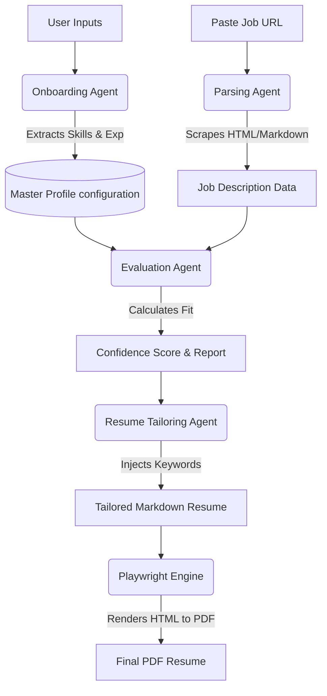

# 🎯 Career Agents

**Career Agents** is a fully-local, AI-native multi-agent pipeline designed to automate and optimize your job search. 

Instead of spending hours manually tailoring your resume to get past applicant tracking systems (ATS), Career Agents uses LLMs to evaluate job descriptions, map your core competencies, and dynamically generate pixel-perfect, highly-tailored PDF resumes—all without diluting your technical depth or adding generic corporate fluff.

---

## ✨ Core Features

* **Agentic Job Evaluation:** Paste a job board URL. The AI fetches the Job Description (JD), evaluates your technical fit against your master profile, and generates a detailed "Confidence Score."
* **Zero-Fluff PDF Tailoring:** Automatically rewrites your resume to inject high-signal keywords based on the JD. It preserves your "builder vibe" and strong action verbs while compiling directly to PDF via Playwright.
* **Local FastAPI Dashboard:** Manage your pipeline through a blazing-fast local web interface with interactive SVG icons and animated loaders. 
* **Application Tracker:** Seamlessly logs every evaluation and generated PDF into a central Markdown tracker (`data/applications.md`).
* **Graphify Support:** Built-in support to visualize the codebase using an AST-based knowledge graph.

---

## 🚀 Getting Started (From Scratch)

If you are a new user looking to build, run, and push your own version of Career Agents, follow these exact steps.

### 1. Clone the Repository
Open your terminal and clone this repository to your local machine:
```bash
git clone https://github.com/tanujtp/career-agents.git
cd career-agents
```

### 2. System Requirements
Ensure you have the following installed on your machine:
- **Python 3.10 or higher**
- **Node.js 18 or higher** (Required for the HTML-to-PDF engine)
- An active **OpenAI API Key**

### 3. Setup the Python Environment
Create an isolated virtual environment and install the required Python packages:
```bash
# Create the virtual environment
python3 -m venv .venv

# Activate it (Mac/Linux)
source .venv/bin/activate
# On Windows use: .venv\Scripts\activate

# Install dependencies
pip install fastapi uvicorn pymupdf python-docx markdown requests langchain openai
```

### 4. Setup the Node.js PDF Engine
The pipeline relies on Playwright to render pixel-perfect tailored resumes.
```bash
# Install node dependencies
npm install playwright

# Install the headless Chromium browser required by Playwright
npx playwright install chromium
```

### 5. Environment Variables
Create a file named `.env` in the root directory of the project and add your API keys:
```env
OPENAI_API_KEY=your_api_key_here
CAREER_OPS_MODEL=gpt-4o  # You can change this to your preferred model
```

### 6. Launch the Dashboard
Fire up the local FastAPI server:
```bash
PYTHONPATH=. python agent/server.py
```
Open your browser and navigate to: **[http://localhost:8000](http://localhost:8000)**

---

## 🧠 Under the Hood: How the Agents Work

Career Agents isn't just a basic LLM wrapper—it's a multi-stage, autonomous pipeline. Here is exactly what happens in the background when you use the system.

### The Core Architecture



### 1. Onboarding & Parsing
When you first upload your resume, the **Onboarding Agent** reads the document (using PyMuPDF) and extracts your core narrative. It maps your hard skills, soft skills, and experiences into a centralized "Master Profile" (`config/profile.yml`). This ensures the system never invents fake experiences—it only pulls from your verified background.

### 2. Evaluating & Scoring
When you paste a job board URL, the **Parsing Agent** fetches the raw HTML and converts it into clean Markdown. The **Evaluation Agent** then compares the Job Description against your Master Profile.
- **Scoring System:** It analyzes technical overlap, required years of experience, and culture fit to generate a "Confidence Score" out of 5.0. 
- **The Output:** A brutally honest evaluation report detailing exactly where you match the role and where you fall short.

### 3. Tailoring the Resume (Zero-Fluff)
If the evaluation is successful, the **Resume Tailoring Agent** kicks in. It dynamically injects high-signal keywords from the Job Description into your master resume.
- **The Rule:** It is strictly forbidden from diluting your strong verbs (e.g., "Built", "Architected") into generic corporate fluff (e.g., "Managed", "Collaborated"). It preserves your "builder vibe" while satisfying the ATS filters.

### 4. Compiling the Final PDF
The tailored markdown is injected into a beautifully designed HTML template. Career Agents then spins up a headless Chromium browser using **Playwright** to print the HTML directly to a pixel-perfect PDF. This ensures your resume has immaculate typography, selectable text (for ATS parsing), and standard A4/Letter dimensions.

---

## 🛠️ Pushing Your Changes to Git

If you've made customizations to your local setup and want to push them back to your repository, follow these steps:

```bash
# 1. Check the status of your changed files
git status

# 2. Stage all your changes
git add .

# 3. Commit the changes with a descriptive message
git commit -m "feat: setup career agents pipeline and dashboard"

# 4. Push to your main branch
git push origin main
```

---

## 🤝 Contributing & Architecture

* **Agents:** Powered by modular system prompts (`modes/*.md`) and executed via the local Python agent executor.
* **UI:** A completely standalone, vanilla HTML/CSS dashboard served directly through FastAPI.
* **Visualizing the Codebase:** We support [Graphify](https://github.com/safishamsi/graphify).

Feel free to fork the repository and submit Pull Requests to add new LLM providers, enhance the PDF templating engine, or build out automated application submitting agents!

## 📜 License

MIT License. See `LICENSE` for more details. Build aggressively.
